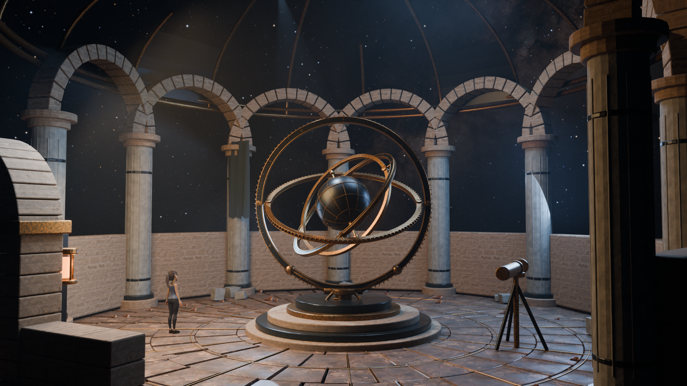

# The Last Observatory — Arrival

A 24-second Blender cinematic: a young woman walks through an open bronze doorway into a ruined observatory, where nested astronomical rings turn beneath the Milky Way.

**[Watch / download the finished trailer](https://media.githubusercontent.com/media/codersusu/game-cinematic-trailor/main/The%20Last%20Observatory%20-%20Arrival.mp4)** · [Walking preview](https://media.githubusercontent.com/media/codersusu/game-cinematic-trailor/main/previews/v2/Arrival-motion-1080p.mp4) · [Editable Blender scene](observatory-v2.blend)



Rendered and verified at **1920 × 1080, 24 fps, 24 seconds**, with stereo sound and a 2.39:1 active image. All 576 frames were decoded successfully. Encoded audio measures −18.02 LUFS and −2.68 dBTP without clipping. The character uses Blender Studio's stylized Rain rig.

## What is included

- Finished Arrival trailer and the original trailer for comparison.
- Editable `observatory-v2.blend`, with all required textures, star panorama, Rain source rig, cameras and animation.
- Reproducible scene, animation, render, audio and encoding scripts.
- Completed soundtrack, eight editable v2 stems, source effects and foot-contact timing.
- [Production notes](docs/revision-v2.md), [visual review](previews/v2/final-contact-sheet.jpg), and [verification results](renders/v2/movie-qa.json).

Blender applications, Python runtimes, intermediate image sequences, backups and temporary test scenes are omitted. The original v1 movie is included; the larger v1 editable scene and Einar source asset are not part of this submission. The production render manifest records the original rendered build; submission scripts include small portability changes.

## Get the complete project

Large binaries use **Git LFS**. Install [Git LFS](https://git-lfs.com/), then clone with its files:

```sh
git lfs install
git clone https://github.com/codersusu/game-cinematic-trailor.git
cd game-cinematic-trailor
git lfs pull
```

A normal GitHub source ZIP may contain LFS pointers instead of the actual media. Clone with LFS for the complete editable project.

Open `observatory-v2.blend` in **Blender 4.5 LTS**. Asset paths are relative to the repository. On macOS, `Open Arrival.command` locates an installed Blender; `BLENDER_BIN` can specify another executable. The original film was rendered on Apple Silicon using Cycles Metal, with MetalRT and kernel optimization disabled for stability. `scripts/configure_gpu.py` applies those settings to a Mac Blender session.

## Rebuild and render

Install Python 3.11 or newer and the encoding/audio dependencies:

```sh
python3 -m venv .venv
. .venv/bin/activate
python -m pip install -r requirements.txt
```

With `blender` on PATH:

```sh
blender --background --python scripts/build_scene_v2.py
blender --background observatory-v2.blend --python scripts/render_v2.py -- preview 64 130 390 520
sh scripts/finish_film_v2.sh
```

Alternatively set `BLENDER_BIN` and `PYTHON_BIN` to your executables. `OBS_CPU=1` explicitly selects CPU rendering. The renderer is configured for the validated Mac Metal setup and falls back to CPU if Metal is unavailable; configure another GPU backend as appropriate on other systems.

The final pass uses Cycles, 48 samples with adaptive sampling and denoising, motion blur, AgX, and an 8192 texture cap to preserve stars. Rendering resumes from existing numbered PNGs in `renders/v2/frames/`; move those frames aside before rendering a changed scene. They are generated locally and ignored by Git.

The encoder uses Baskerville/Arial on macOS or DejaVu Serif/Sans on Linux. Set `OBS_SERIF_FONT` and `OBS_SANS_FONT` to other font files if needed. Rebuilding with substitute fonts changes the title typography; the supplied finished movie preserves the original typography.

The supplied audio needs no API access. `python scripts/audio_mix_v2.py` rebuilds the mix from local sources. The separate generation scripts only run when explicitly invoked with `--env-file`; they require your own ElevenLabs credentials. No credentials are included.

## Animation

| Time | Shot |
|---|---|
| 0–8 s | Doorway entrance with grounded footsteps and a moving camera |
| 8–12 s | Close view of the turning bronze instrument |
| 12–20 s | Wide observatory reveal beneath the stars |
| 20–24 s | Luminous constellation inlays, continuing rotation, title and credits |

The nested gimbals travel 78° / 180° / −210° / 240° over the film. Shared-axis bearings stay attached while the pedestal remains fixed. Footsteps follow 18 authored contact events; banners and the keeper's ponytail also move. The star panorama remains fixed in world space, with its orientation composed for the scene.

## Credits and asset rights

**Rain Rig (CC) Blender Foundation | studio.blender.org** — [Rain](https://studio.blender.org/characters/rain/v3/), CC BY 4.0. Costume colors, walking animation, pose and corneal shadow handling were adapted. [Character attribution](assets/character/young_keeper/ATTRIBUTION.md).

**NASA/Goddard Space Flight Center Scientific Visualization Studio. Gaia DR2: ESA/Gaia/DPAC.** The 8K sky is from [Deep Star Maps 2020](https://svs.gsfc.nasa.gov/4851/), visualization by Ernie Wright. [Source, checksum and usage terms](docs/sky-v2.md).

**Powered by Poly Haven.** Scanned stone, metal and rocks are CC0. [Asset credits](docs/assets-manifest.md).

Sound effects were generated with ElevenLabs; the underscore and additional atmospheric synthesis were authored for the film. Generated audio is not CC0 and follows the account plan and service terms. [Audio sources and rights](audio/v2/README.md).

The original comparison movie uses **Einar Rig (CC-BY) Blender Foundation | studio.blender.org**. [Original character attribution](assets/character/ATTRIBUTION.md). Third-party assets retain their individual licenses; this repository does not relicense them under a single blanket license.
