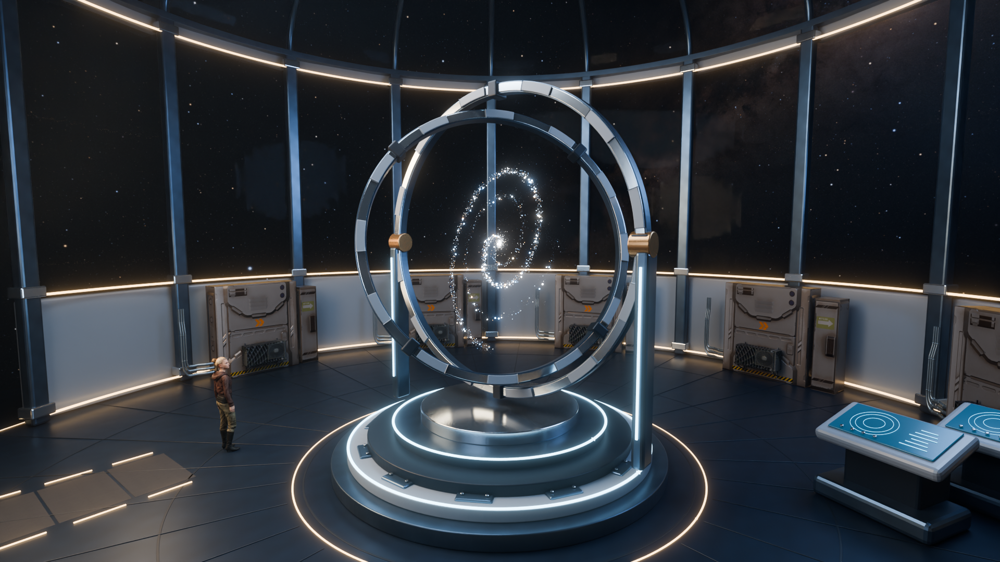

> **V6 reach preview:** [See the new one-handed animation and editable scene](README-v6.md). The revised full film is rendering.

# The Last Observatory — Astra Chamber

A 24-second cinematic set inside a modern orbital observatory. The same young woman enters through a sliding airlock, reacts with surprise and wonder, and watches the Astra galaxy turn inside a new precision instrument.

[Watch the six-second motion preview](https://media.githubusercontent.com/media/codersusu/game-cinematic-trailor/main/previews/v5/Astra-Chamber-motion-proof.mp4) · [Editable Blender scene](observatory-v5.blend)

**V5 is complete.** [Watch the finished film](https://media.githubusercontent.com/media/codersusu/game-cinematic-trailor/main/The%20Last%20Observatory%20-%20Astra%20Chamber.mp4) · [View the 4K still](renders/v5/hero-4k.png)

Native 1920 × 1080, 24 fps, 24 seconds. All 576 frames decode correctly. Representative final shots, the title and the 4K still were visually reviewed; the encoded stereo soundtrack passes technical checks. [Final contact sheet](previews/v5/final-contact-sheet.jpg) · [Movie QA](renders/v5/movie-qa.json) · [Delivery manifest](renders/v5/render-manifest.json).



## What changed

The ruined room becomes a panoramic chamber with titanium ribs, pale wall panels, warm guide lights and a charcoal deck. Two rotating instrument rings surround the original stellar spiral. The airlock opens and the arrival lights illuminate in sequence. Camera paths have been reframed for the new room, and the soundtrack adds an electric door, ventilation and muted deck footsteps.

The **V4 character mesh, native walking animation, facial expressions and Astra galaxy are preserved exactly** according to the [scene comparison](renders/v5/preservation-audit.json). V5 carries over the reviewed performance without retargeting or replacing the woman.

Free resources are used in the actual scene: ambientCG and Poly Haven surfaces, plus four selected Irondust/rubberduck/a52 service meshes placed in six perimeter bays. The room structure, airlock, consoles and instrument are custom geometry. [Sources and adaptations](docs/resources-v5.md) · [Curated reusable library](assets/v5/models/README.md).

## Deliverables

| File | Purpose |
|---|---|
| `The Last Observatory - Astra Chamber.mp4` | Final 1920 × 1080, 24 fps, 24-second film |
| `observatory-v5.blend` | Editable Blender scene |
| `Open Astra Chamber.command` | Mac launcher using an installed Blender |
| `previews/v5/Astra-Chamber-motion-proof.mp4` | Six-second entrance, instrument and room motion proof |
| `renders/v5/hero-4k.png` | Separate native 3840 × 2160 room still |
| `audio/v5/` | Stereo soundtrack, editable stems and sound provenance |
| `assets/v5/` | Selected material maps and portable service-model library |

The film uses a 2.39:1 active image inside a 1080p frame. The 4K still is a separate output. Earlier films and scenes remain available: [Wonder V4](README-v4.md), [Celestial V3](README-celestial.md), and [Arrival V2](README-arrival.md).

## Open or rebuild

```sh
git lfs install
git clone https://github.com/codersusu/game-cinematic-trailor.git
cd game-cinematic-trailor
git lfs pull
```

Open `observatory-v5.blend` in Blender 4.5 LTS with `assets/` alongside it. No service credentials are required. To rebuild the room, keep the included `observatory-v4.blend` as its source for the baked character, galaxy and sky.

```sh
python3 -m pip install -r requirements.txt
export BLENDER_BIN=blender
export PYTHON_BIN=python3
"$BLENDER_BIN" --background --disable-autoexec --python-exit-code 1 --python scripts/build_scene_v5.py
sh scripts/finish_film_v5.sh
```

The pipeline renders 576 frames, adds sound and titles, decodes the movie for verification, produces the 4K still, audits scene dependencies, verifies the encoded audio, and records output checksums. Rendering resumes numbered PNGs and refuses to combine frames from different saved-scene hashes. Mac Metal uses MetalRT and kernel optimization off; `OBS_CPU=1` enables CPU rendering. [Detailed build instructions and audit evidence](docs/build-v5.md).

## Asset scope and credits

Microsoft Rocketbox Female Adult 04 and its native motion retain their MIT license. The new surface maps and service meshes are CC0; the NASA/Goddard SVS star map retains its documented NASA/ESA/Gaia credits. The soundtrack combines original synthesis with previously generated ElevenLabs footfalls under their original terms. No new paid API requests were needed for V5. [Character attribution](assets/character/heroine_v4/ATTRIBUTION.md) · [Sky attribution](docs/sky-v2.md) · [Audio sources](audio/v5/README.md).

This is a pre-rendered Blender cinematic. The accepted character is an older game asset; its skin and hair remain below current cinematic digital humans. Perimeter panel relief is largely texture-based, while the close-view instrument uses modeled edges and fittings. There is no interactive gameplay in this deliverable.
