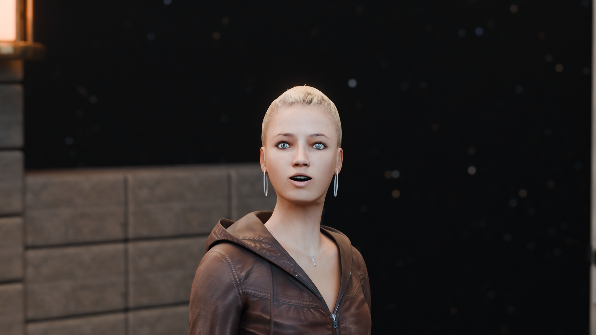

# The Last Observatory — Wonder

[V5 Astra Chamber: editable scene and motion preview](README-v5.md) is now available. Its full 1080p film is rendering.

A 24-second cinematic revision focused on character performance: a young adult woman reacts at the threshold, walks naturally into the observatory, and watches the rotating stellar machine with growing wonder.

**[Watch / download the finished trailer](https://media.githubusercontent.com/media/codersusu/game-cinematic-trailor/main/The%20Last%20Observatory%20-%20Wonder.mp4)** · [Acting preview](https://media.githubusercontent.com/media/codersusu/game-cinematic-trailor/main/previews/v4/Native-walk-and-expressions.mp4) · [Editable Blender scene](observatory-v4.blend)



**Movie complete:** 576 frames rendered and decoded at native **1920 × 1080, 24 fps, 24 seconds**. Representative movie frames and facial/motion proofs were visually reviewed. Encoded stereo audio measures **−17.8 LUFS and −2.8 dBTP**, without clipping. [Final contact sheet](previews/v4/final-contact-sheet.jpg) · [Movie verification](renders/v4/movie-qa.json).

## Character and animation

The selected character is **Female Adult 04 from Microsoft Rocketbox**, with the same library's native start, walking, stopping and breathing animations. The source has 80 bones, 175 facial shapes, and 2K surface textures. Its authored whole-body motion replaces the previous procedural leg solve. Blender materials and surface smoothing are adapted for Cycles.

The initial surprise uses brows, eyelids and jaw; the later reaction combines gaze, a softly rounded mouth and a restrained smile. Both beats receive moving close shots. Eleven footsteps and the doorway acoustic transition follow the new native motion.

This is an older game character with a much more complete animation rig. Its skin and hair detail remain below modern cinematic digital humans. The more detailed [Jungle Jim candidate](https://sketchfab.com/3d-models/realistic-woman-walking-animated-d1ce2b8009b8401481408aeecea903d0) requires an authenticated Sketchfab download; its source was not acquired. [Research and selection record](docs/character-research-v4.md).

## Files

| Deliverable | File |
|---|---|
| Final 1080p, 24 fps, 24-second movie | `The Last Observatory - Wonder.mp4` |
| Editable Blender scene | `observatory-v4.blend` |
| Mac launcher | `Open Wonder.command` |
| Short acting preview | `previews/v4/Native-walk-and-expressions.mp4` |
| Native 4K reaction portrait | `renders/v4/hero-4k.png` |
| Master soundtrack and editable stems | `audio/v4/` |
| Character, native motion and source license | `assets/character/heroine_v4/` |

The movie keeps a 2.39:1 active image inside a native 1920 × 1080 frame. The separate 4K portrait is not a 4K movie. The galaxy, astronomical rings, star-catalog sky and moving observatory shots continue from V3. Previous movies and scenes are preserved, including [Celestial V3](README-celestial.md) and [Arrival V2](README-arrival.md).

## Open and render

Large assets use Git LFS:

```sh
git lfs install
git clone https://github.com/codersusu/game-cinematic-trailor.git
cd game-cinematic-trailor
git lfs pull
```

Open `observatory-v4.blend` with Blender 4.5 LTS and keep `assets/` alongside it. No service keys are needed for the supplied scene or models. The Mac launcher finds an installed Blender using `BLENDER_BIN`, the project-local application, the command path, or `/Applications/Blender.app`.

To rebuild, use Blender 4.5 and a separate Python with Pillow, NumPy, SoundFile and imageio-ffmpeg. Blender supplies its own NumPy for scene construction.

```sh
export BLENDER_BIN=blender
export PYTHON_BIN=python3
"$BLENDER_BIN" --background --disable-autoexec --python scripts/build_scene_v4.py
"$BLENDER_BIN" --background --disable-autoexec observatory-v4.blend --python scripts/render_v4.py -- preview 15 82 317 331 390
sh scripts/finish_film_v4.sh
```

The final pipeline renders 576 frames, encodes sound and titles, decodes the film for verification, renders the 4K portrait, and audits scene dependencies and facial keys. Mac Metal uses MetalRT off and kernel optimization off. Use `OBS_CPU=1` for CPU rendering. Final rendering resumes existing numbered PNGs; move old V4 frames aside after changing the scene.

[Performance notes](docs/performance-v4.md) · [Character attribution](assets/character/heroine_v4/ATTRIBUTION.md) · [Audio sources](audio/v4/README.md)

The character and native motions are distributed under Microsoft's retained MIT license. Environment scans are [Poly Haven CC0](docs/assets-manifest.md); the [NASA/Goddard star map](docs/sky-v2.md) and [ElevenLabs source effects](audio/v2/README.md) retain their documented terms. No new Meshy or ElevenLabs requests were made for V4.
